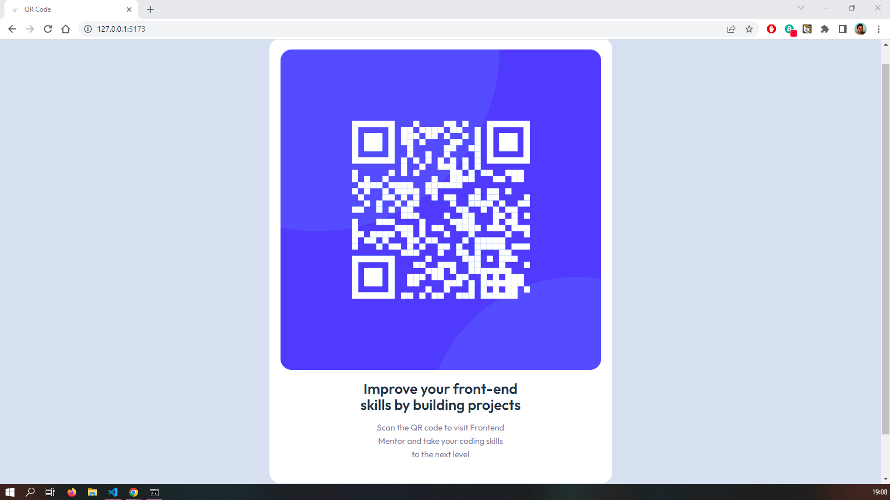

# Frontend Mentor - QR code component solution

This is a solution to the [QR code component challenge on Frontend Mentor](https://www.frontendmentor.io/challenges/qr-code-component-iux_sIO_H). Frontend Mentor challenges help you improve your coding skills by building realistic projects. 

## Overview

### Screenshot

### Links

- Solution URL: [Add solution URL here](https://your-solution-url.com)
- Live Site URL: [Add live site URL here](https://your-live-site-url.com)

## My process

### Built with

- Semantic HTML5 markup
- CSS custom properties
- Vite
- [React](https://reactjs.org/) - JS library

## Author

- Website - [Sebastian Lopez Meyer (https://www.linkedin.com/in/sebasti%C3%A1n-lopez-meyer-a37160198/)
- Frontend Mentor - [@sebastianlm7](https://www.frontendmentor.io/profile/sebastianlm7)
- Twitter - [@sebalmeyer](https://www.twitter.com/sebalmeyer)

